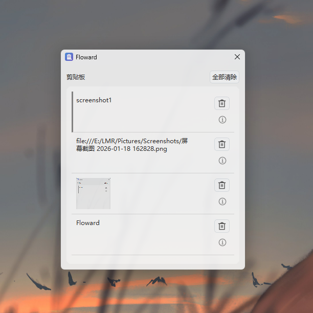

# Floward
[中文](README_zh.md)

/fləʊ-wərd/ (pronounced similar to Forward)

A cross-platform clipboard management tool based on Qt, supporting multi-device synchronization. You can select items from clipboard history for pasting. It provides an easy way to view clipboard history and quickly paste any previously copied content.



## Features

- 📋 Local clipboard management
- 🔄 Real-time multi-device data synchronization (text, images)
- 🖼️ Automatic image sync, download, and clipboard update
- ⚡ Global hotkey support, customizable(default is `Alt + V`)
- 🎯 Runs in system tray

## Use Cases

Floward is particularly suitable for the following scenarios:

- 💻 **Multi-device Workflow**: Copy code snippets on desktop, paste directly on laptop
- 🎨 **Design Workflow**: Copy images on one device, use immediately on another without manual transfer
- 📝 **Remote Work**: Seamlessly share clipboard content across devices in different locations
- 🔐 **Data Security**: Ensure sensitive data doesn't pass through third-party services by self-hosting the server

## Version Information

[Releases](https://github.com/L-Super/Floward/releases) provides two versions with the following differences:

| Version     | Description                                              |
| ----------- | -------------------------------------------------------- |
| Standalone  | Local only. Data stays on your device. No internet required. |
| Sync        | Supports multi-device synchronization. Syncs data across different devices. |

## Build

Build Requirements:

- C++ 20
- Qt 6.0+
- CMake


```bash
cmake -B build
cmake --build build
```

## Client Configuration

This application requires a sync server to enable multi-device synchronization. You can deploy your own server using [ClipboardServer](https://github.com/L-Super/ClipboardServer). For detailed information about server deployment and configuration, please refer to the ClipboardServer project documentation.

### Configure Sync Server

**Method 1:**

1. Run Floward
2. Open the sync server web service URL
3. Enter your account credentials to login

**Method 2:**

1. Run Floward, open Floward Settings - Sync
2. Enter the server URL, e.g.: `https://your-domain.com`
3. Click Login, which will open the web page
4. Enter your account credentials to login

After configuration, the application will automatically connect to the server and start synchronizing clipboard data.

## Contributing

Contributions welcome - submit issues and pull requests.

## License

[MIT License](LICENSE)